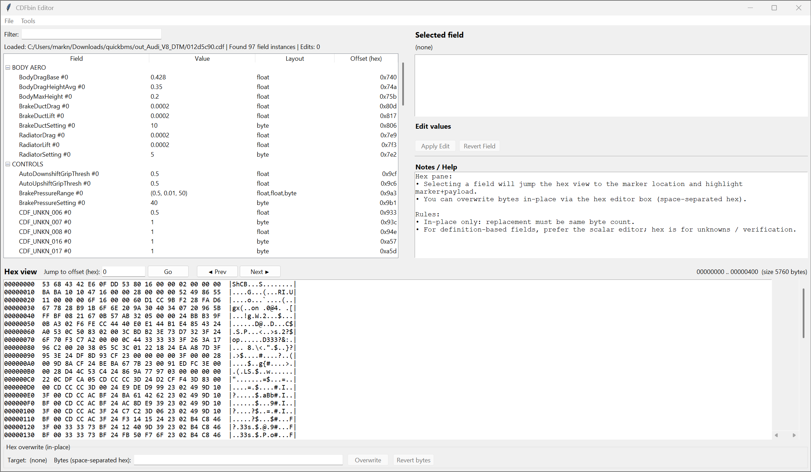

# CDFbin Editor (Project CARS) — `cdf_editor.py`

A small **definition-driven editor + hex viewer/editor** for *Project CARS* **CDFbin** files.

- Scans a binary `.cdf` / `.cdfbin` file for known **marker bytes**
- Decodes the following **payload scalar types**: `byte`, `float`, `int32`, `uint32`
- Lets you edit values **in-place only** (the payload size must not change)
- Includes a **hex viewer** with click-to-select and **in-place overwrite** tooling
- Performs a **CDF header byte-count register sanity check** on open/save-as and can apply a conservative repair

> ⚠️ This tool modifies binary files. Always keep backups.



## Features

### Definition-driven field browser
- Fields are defined in `CDF_DEFS` as `CdfFieldDef` entries:
  - `section`, `name`, `marker`, `layout`, `notes`
- The app scans for all occurrences of each marker, decodes its payload, and lists them in a Treeview grouped by section.
- A filter box allows quick narrowing by section/name/occurrence.

### Scalar editor (safe path)
- When you select a field, the right panel shows:
  - marker bytes & offsets
  - payload offset
  - raw payload bytes
  - decoded value tuple
- You can edit via typed scalar inputs.
- Edits are applied **in-place** (exact same byte count as original payload).

### Hex viewer/editor (verification + unknowns)
- Bottom pane shows a classic hex dump.
- Selecting a field jumps to its marker and highlights:
  - marker bytes
  - payload bytes
- Clicking a byte in the hex view selects the corresponding field in the tree (where known).
- You can overwrite the selected payload bytes by pasting space-separated hex.
- Revert options exist for both scalar edits and hex overwrites.

### Byte Count Registers check (header validation / repair)
On open and before “Save As…”, the tool checks common CDF header “byte count registers”:

- `R0` @ `0x0008` should match file length
- `R1` @ `0x0014` should match `(R3 - 0x0028)` (if `R3 >= 0x0028`)
- `R2` @ `0x0020` should be end-length
- `R3` @ `0x0024` should be end-start
- Consistency: `R3 + R2 == file_len`

If inconsistent, the app will show problems and may offer an **automatic conservative repair**.

---

## Requirements

- Python 3.10+ (recommended)
- Standard library only (`tkinter` ships with most Python installs on Windows)

> Windows DPI awareness is enabled when available via `ctypes`.

---

## Run

```bash
python cdf_editor.py
